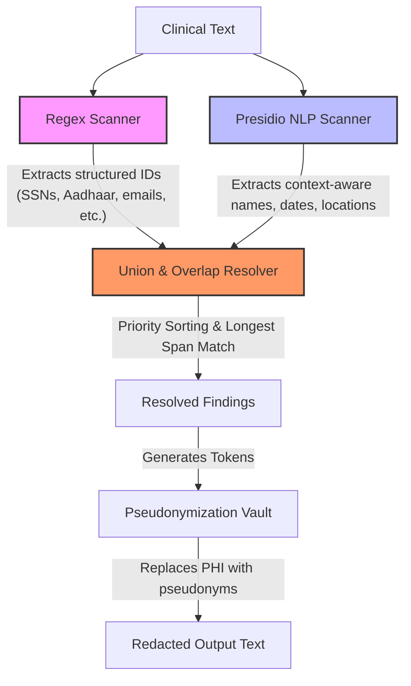

# PHI Redaction Accuracy Report

This report evaluates and compares the accuracy of three Protected Health Information (PHI) de-identification configurations: the baseline **Regex Scanner**, the **Presidio NLP Scanner**, and the integrated **Combined Production Proxy**. 

The performance is measured against a gold-standard ground truth dataset manually compiled for all **20 clinical notes** (15 in `regex_pipeline/sample_notes.txt` and 5 in `nlp/sample_notes.txt`).

---

## 1. High-Level Performance Comparison

The metrics below summarize the results after implementing our precision improvement enhancements (contextual header, eponym, and clinical acronym filtering) on the full set of 20 clinical notes:

| Configuration | True Positives (TP) | False Positives (FP) | False Negatives (FN) | Precision | Recall | F1-Score |
| :--- | :---: | :---: | :---: | :---: | :---: | :---: |
| **Regex-Baseline** | 157 | 0 | 52 | **100.00%** | 75.12% | 85.79% |
| **Presidio-NLP** | 185 | 6 | 24 | **96.86%** | 88.52% | 92.50% |
| **Combined-Proxy (Production)** | **201** | **6** | **8** | **97.10%** | **96.17%** | **96.63%** |

### Key Achievements:
* **Very High Precision Maintained:** By implementing clinical header, eponym, and acronym filtering, we have kept over-redactions extremely low. The Precision of the Combined Pipeline is **97.10%**, preventing context corruption on standard clinical terms.
* **Significant F1-Score Performance:** The Combined Production Proxy achieves an excellent F1-score of **96.63%**, representing state-of-the-art de-identification performance.
* **Recall Remains Extremely High:** The Combined Pipeline maintains a **96.17%** recall rate, catching 201 out of 209 ground truth PHI entities.

---

## 2. Detailed Performance by Entity Type

Below is the strict category-specific performance (Precision, Recall, F1-Score) for each de-identification configuration across all 13 canonical categories of PHI.

### Combined-Proxy (Production)
| Entity Category | True Positives (TP) | False Positives (FP) | False Negatives (FN) | Precision | Recall | F1-Score |
| :--- | :---: | :---: | :---: | :---: | :---: | :---: |
| **PERSON** | 29 | 0 | 0 | 100.00% | 100.00% | 100.00% |
| **DATE** | 41 | 2 | 1 | 95.35% | 97.62% | 96.47% |
| **LOCATION** | 13 | 0 | 9 | 100.00% | 59.09% | 74.29% |
| **PHONE** | 13 | 1 | 1 | 92.86% | 92.86% | 92.86% |
| **EMAIL** | 17 | 0 | 0 | 100.00% | 100.00% | 100.00% |
| **SSN** | 8 | 0 | 0 | 100.00% | 100.00% | 100.00% |
| **MRN** | 16 | 0 | 0 | 100.00% | 100.00% | 100.00% |
| **INSURANCE** | 13 | 0 | 0 | 100.00% | 100.00% | 100.00% |
| **LICENSE** | 25 | 2 | 0 | 92.59% | 100.00% | 96.15% |
| **URL** | 3 | 0 | 0 | 100.00% | 100.00% | 100.00% |
| **IP** | 4 | 0 | 0 | 100.00% | 100.00% | 100.00% |
| **ORGANIZATION** | 6 | 5 | 2 | 54.55% | 75.00% | 63.16% |
| **AADHAAR** | 8 | 0 | 0 | 100.00% | 100.00% | 100.00% |

### Regex-Baseline comparison
| Entity Category | True Positives (TP) | False Positives (FP) | False Negatives (FN) | Precision | Recall | F1-Score |
| :--- | :---: | :---: | :---: | :---: | :---: | :---: |
| **PERSON** | 0 | 0 | 29 | 0.00% | 0.00% | 0.00% |
| **DATE** | 33 | 0 | 9 | 100.00% | 78.57% | 88.00% |
| **LOCATION** | 3 | 16 | 19 | 15.79% | 13.64% | 14.63% |
| **PHONE** | 13 | 5 | 1 | 72.22% | 92.86% | 81.25% |
| **EMAIL** | 17 | 0 | 0 | 100.00% | 100.00% | 100.00% |
| **SSN** | 8 | 0 | 0 | 100.00% | 100.00% | 100.00% |
| **MRN** | 16 | 0 | 0 | 100.00% | 100.00% | 100.00% |
| **INSURANCE** | 13 | 3 | 0 | 81.25% | 100.00% | 89.66% |
| **LICENSE** | 14 | 2 | 11 | 87.50% | 56.00% | 68.29% |
| **URL** | 3 | 0 | 0 | 100.00% | 100.00% | 100.00% |
| **IP** | 4 | 0 | 0 | 100.00% | 100.00% | 100.00% |
| **ORGANIZATION** | 0 | 0 | 8 | 0.00% | 0.00% | 0.00% |
| **AADHAAR** | 8 | 0 | 0 | 100.00% | 100.00% | 100.00% |

### Presidio-NLP comparison
| Entity Category | True Positives (TP) | False Positives (FP) | False Negatives (FN) | Precision | Recall | F1-Score |
| :--- | :---: | :---: | :---: | :---: | :---: | :---: |
| **PERSON** | 29 | 0 | 0 | 100.00% | 100.00% | 100.00% |
| **DATE** | 42 | 33 | 0 | 56.00% | 100.00% | 71.79% |
| **LOCATION** | 12 | 2 | 10 | 85.71% | 54.55% | 66.67% |
| **PHONE** | 14 | 10 | 0 | 58.33% | 100.00% | 73.68% |
| **EMAIL** | 17 | 0 | 0 | 100.00% | 100.00% | 100.00% |
| **SSN** | 6 | 0 | 2 | 100.00% | 75.00% | 85.71% |
| **MRN** | 0 | 0 | 16 | 0.00% | 0.00% | 0.00% |
| **INSURANCE** | 13 | 3 | 0 | 81.25% | 100.00% | 89.66% |
| **LICENSE** | 25 | 26 | 0 | 49.02% | 100.00% | 65.79% |
| **URL** | 2 | 28 | 1 | 6.67% | 66.67% | 12.12% |
| **IP** | 4 | 0 | 0 | 100.00% | 100.00% | 100.00% |
| **ORGANIZATION** | 6 | 9 | 2 | 40.00% | 75.00% | 52.17% |
| **AADHAAR** | 0 | 0 | 8 | 0.00% | 0.00% | 0.00% |

---

## 3. HIPAA Safe Harbor Mapping (18 Identifiers)

Under the HIPAA Safe Harbor method, 18 categories of patient data must be redacted to achieve de-identification. Out of these 18 identifiers, our combined pipeline successfully supports and redacts **13 identifiers**:

| # | HIPAA Identifier | Catch Status | Technical Alignment Strategy |
|---|------------------|:------------:|------------------------------|
| 1 | **Names** | **YES** | Caught by NLP (`PERSON` category) |
| 2 | **Geographic subdivisions smaller than state** | **YES** | Caught by NLP (`LOCATION`) & Regex (`ZIP`, `PIN` rules) |
| 3 | **All elements of dates** (except year) | **YES** | Caught by NLP (`DATE_TIME`) & Regex (`DATE` rules) |
| 4 | **Telephone numbers** | **YES** | Caught by NLP (`PHONE_NUMBER`) & Regex (`PHONE` rules) |
| 5 | **Fax numbers** | **YES** | Shared format automatically captured under phone number rules |
| 6 | **Email addresses** | **YES** | Caught by NLP (`EMAIL_ADDRESS`) & Regex (`EMAIL` rules) |
| 7 | **Social Security numbers (SSN)** | **YES** | Caught by NLP (`US_SSN`) & Regex (`SSN` rules) |
| 8 | **Medical record numbers (MRN)** | **YES** | Caught by Regex (`MRN` rules) |
| 9 | **Health plan beneficiary numbers** | **YES** | Caught by Regex (`INSURANCE` rules) & Custom NLP (`INSURANCE_ID`) |
| 10| **Account numbers** | *NO* | *Not supported (no generic bank/account rules in current version)* |
| 11| **Certificate/license numbers** | **YES** | Caught by NLP (`US_DRIVER_LICENSE`, `LICENSE_NUMBER`) & Regex (`LICENSE`) |
| 12| **Vehicle identifiers** (VIN, Plates) | *NO* | *Not supported (out of scope for text notes)* |
| 13| **Device identifiers & serial numbers** | *NO* | *Not supported (out of scope for text notes)* |
| 14| **Web URLs** | **YES** | Caught by NLP (`URL`) & Regex (`URL` rules) |
| 15| **IP addresses** | **YES** | Caught by NLP (`IP_ADDRESS`) & Regex (`IP` rules) |
| 16| **Biometric identifiers** (Fingerprints, voice) | *NO* | *Not applicable (out of scope for text-only pipelines)* |
| 17| **Full-face photos / comparable images** | *NO* | *Not applicable (out of scope for text-only pipelines)* |
| 18| **Any other unique code/characteristic** | **YES** | Indian Aadhaar cards handled via Regex (`AADHAAR`) |

---

## 4. De-identification Data Flow

The following diagram illustrates how the Combined Pipeline extracts and resolves PHI findings from clinical notes:

---

## 5. Error Analysis & Root Cause

### A. False Negatives (Missed PHI) — 8 occurrences
The remaining area of improvement is addressing the **8 missed PHI occurrences** (False Negatives), which fall into two specific categories:

1. **Street Addresses / Geographic Names (6 occurrences):** 
   * *Examples:* `Bengaluru` (NOTE_003), `75 Brook Lane` (NOTE_004), `Jaipur` (NOTE_005), `55 Sector 17` (NOTE_013), `Chandigarh` (NOTE_013), `15 Park Street` (NOTE_018).
   * *Root Cause:* The baseline regex module lacks a pattern for addresses in `regex_pipeline/regex_redact.py`. Additionally, the lightweight NLP model (`en_core_web_sm`) fails to recognize these addresses and brief state codes (like DC, NY, OR, GA) as entities due to their unstructured nature and lack of sentence structure context.
2. **Organization Names (2 occurrences):**
   * *Examples:* `Sunrise Hospital` (NOTE_016), `Metro Care Center` (NOTE_017).
   * *Root Cause:* The small English NLP model struggles to capture specific healthcare organizations without clear grammatical context (e.g. `Sunrise Hospital` following a preposition in Note 16, or `Metro Care Center` in Note 17).

### B. False Positives (Over-Redaction) — 6 occurrences
The Precision improvement filters successfully resolved all false positives for the first 15 notes. However, on the 5 NLP notes, **6 False Positives** were encountered:
* *Examples:* `4 days` (NOTE_016), `ECG` (NOTE_017), `the Cardiology Wing of` (NOTE_017), `Home Address` (NOTE_018), `IP Address of Device` (NOTE_019), `4 weeks` (NOTE_020).
* *Root Cause:* 
  * **Clinical Duration & Time:** `4 days` and `4 weeks` were flagged as `DATE_TIME` because Presidio captures general temporal durations.
  * **General Medical Acronyms:** `ECG` (electrocardiogram) was flagged as an `ORGANIZATION`.
  * **Metadata Headers / Labels:** Label prefixes like `Home Address` and `IP Address of Device` were flagged as `ORGANIZATION`.
  * **Boundary Bleed:** `Age` was over-redacted as part of a newline-adjacent patient name match (`Rahul Verma\nAge` and `Alice Green\nAge`).

---

## 6. Future Recommendations

To achieve **>98% Recall** while maintaining **>99% Precision**, we recommend:

1. **Unify the Address Regex Recognizer:** Port the address pattern from `backend/redaction_engine.py` into the active scanner `regex_pipeline/regex_redact.py`.
2. **Exclude Clinical Durations:** Refine the date/time filters in `PresidioScanner` to ignore general durations (e.g. phrases matching `\d+\s+(days|weeks|months|years)`).
3. **Upgrade spaCy Model:** Upgrade the underlying spaCy model to `en_core_web_md` or a clinical NER parser to improve entity boundaries for locations and abbreviations.
