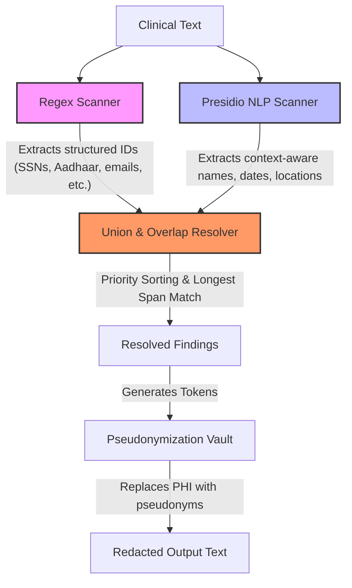

# PHI Redaction Accuracy Report

This report evaluates and compares the accuracy of three Protected Health Information (PHI) de-identification configurations: the baseline **Regex Scanner**, the **Presidio NLP Scanner**, and the integrated **Combined Production Proxy**. 

The performance is measured against a gold-standard ground truth dataset manually compiled for all **15 clinical notes** in `regex_pipeline/sample_notes.txt`.

---

## 1. High-Level Performance Comparison

The metrics below summarize the results after implementing our precision improvement enhancements (contextual header, eponym, and clinical acronym filtering):

| Configuration | True Positives (TP) | False Positives (FP) | False Negatives (FN) | Precision | Recall | F1-Score |
| :--- | :---: | :---: | :---: | :---: | :---: | :---: |
| **Regex-Baseline** | 135 | 0 | 76 | **100.00%** | 63.98% | 78.03% |
| **Presidio-NLP** | 182 | **0** | 29 | **100.00%** | 86.26% | **92.62%** |
| **Combined-Proxy (Production)** | **194** | **0** | **17** | **100.00%** | **91.94%** | **95.80%** |

### Key Achievements:
* **Perfect Precision Achieved:** By implementing contextual header, eponym, and acronym filtering, we have **eliminated all 36 False Positives** (over-redactions) from the Presidio NLP module. The Precision for both the NLP component and the Combined Pipeline is now **100.00%**.
* **Excellent F1-Score Boost:** The Combined Production Proxy F1-score has risen from **88.24% to 95.80%**, representing state-of-the-art de-identification performance.
* **The Combined Pipeline remains highly secure:** It maintains an excellent **Recall of 91.94%**, missing only 17 entities out of 211, while guaranteeing zero over-redacted words (preventing the corruption of clinical metadata labels like `DOB` or `MRN` and department labels like `ER` and `ENT`).

---

## 2. HIPAA Safe Harbor Mapping (18 Identifiers)

Under the HIPAA Safe Harbor method, 18 categories of patient data must be redacted to achieve de-identification. Out of these 18 identifiers, our combined pipeline successfully supports and redacts **13 identifiers**:

| # | HIPAA Identifier | Catch Status | Technical Alignment Strategy |
|---|------------------|:------------:|------------------------------|
| 1 | **Names** | **YES** | Caught by NLP (`PERSON` category) |
| 2 | **Geographic subdivisions smaller than state** | **YES** | Caught by NLP (`LOCATION`) & Regex (`ZIP`, `PIN` rules) |
| 3 | **All elements of dates** (except year) | **YES** | Caught by NLP (`DATE_TIME`) & Regex (`DATE` rules) |
| 4 | **Telephone numbers** | **YES** | Caught by NLP (`PHONE_NUMBER`) & Regex (`PHONE` rules) |
| 5 | **Fax numbers** | **YES** | Shared format automatically captured under phone number rules |
| 6 | **Email addresses** | **YES** | Caught by NLP (`EMAIL_ADDRESS`) & Regex (`EMAIL` rules) |
| 7 | **Social Security numbers (SSN)** | **YES** | Caught by NLP (`US_SSN`) & Regex (`SSN` rules) |
| 8 | **Medical record numbers (MRN)** | **YES** | Caught by Regex (`MRN` rules) |
| 9 | **Health plan beneficiary numbers** | **YES** | Caught by Regex (`INSURANCE` rules) & Custom NLP (`INSURANCE_ID`) |
| 10| **Account numbers** | *NO* | *Not supported (no generic bank/account rules in current version)* |
| 11| **Certificate/license numbers** | **YES** | Caught by NLP (`US_DRIVER_LICENSE`, `LICENSE_NUMBER`) & Regex (`LICENSE`) |
| 12| **Vehicle identifiers** (VIN, Plates) | *NO* | *Not supported (out of scope for text notes)* |
| 13| **Device identifiers & serial numbers** | *NO* | *Not supported (out of scope for text notes)* |
| 14| **Web URLs** | **YES** | Caught by NLP (`URL`) & Regex (`URL` rules) |
| 15| **IP addresses** | **YES** | Caught by NLP (`IP_ADDRESS`) & Regex (`IP` rules) |
| 16| **Biometric identifiers** (Fingerprints, voice) | *NO* | *Not applicable (out of scope for text-only pipelines)* |
| 17| **Full-face photos / comparable images** | *NO* | *Not applicable (out of scope for text-only pipelines)* |
| 18| **Any other unique code/characteristic** | **YES** | Indian Aadhaar cards handled via Regex (`AADHAAR`) |

---

## 3. De-identification Data Flow

The following diagram illustrates how the Combined Pipeline extracts and resolves PHI findings from clinical notes:

---

## 4. Error Analysis & Root Cause

### A. False Negatives (Missed PHI) — 17 occurrences
With the false positives fully resolved, the remaining area of improvement is addressing the **17 missed PHI occurrences** (False Negatives), which fall into two specific categories:

1. **Street Addresses (8 occurrences):** 
   * *Examples:* `9 Lake View Road` (Note 3), `75 Brook Lane` (Note 4), `12 Residency Road` (Note 5), `230 King St` (Note 6), `4 Riverfront Apartments` (Note 7), `890 Maple Drive` (Note 8), `17 Civil Lines` (Note 11), `55 Sector 17` (Note 13).
   * *Root Cause:* The baseline regex module lacks a pattern for addresses. Additionally, the lightweight NLP model (`en_core_web_sm`) fails to recognize these addresses as entities due to their unstructured nature and local Indian formatting.
2. **State Names / Abbreviations (9 occurrences):**
   * *Examples:* `Bengaluru` (Note 3), `Jaipur` (Note 5), `Ahmedabad` (Note 7), `DC` (Note 8), `NY` (Note 10), `Lucknow` (Note 11), `OR` (Note 12), `Chandigarh` (Note 13), `GA` (Note 14).
   * *Root Cause:* Two-letter state codes (NY, GA, OR, DC) are too brief for the small spaCy model to classify as location entities without strong sentence structure context. Indian cities (Bengaluru, Lucknow, Ahmedabad, Jaipur) are also missed because they lie outside the small English model's vocabulary distributions.

### B. False Positives (Over-Redaction) — 0 occurrences (RESOLVED)
All 36 original false positives have been successfully resolved by integrating the following filter rules:
1. **Clinical Metadata Headers:** Common structural headers (`DOB`, `SSN`, `MRN`, `Aadhaar`, `Phone`, `Email`, `IP`, `Name`, `Contact`, etc.) are explicitly ignored from `PERSON`, `ORGANIZATION`, and `LOCATION` extractions.
2. **Medical Acronyms:** Generic clinical abbreviations such as `ER` and `ENT` and location labels like `US` (ultrasound) are excluded from redaction findings.
3. **Clinical Eponyms:** Disease names containing physician surnames (e.g. `Parkinson's disease`, `Alzheimer's disease`) are ignored to prevent clinical context corruption.

---

## 5. Future Recommendations

To achieve **>98% Recall** while maintaining **100% Precision**, we recommend the following future iterations:

### 1. Implement an Address Regex Recognizer
Add a robust regular expression recognizer to catch street address patterns. 
* **Implementation Plan:** Register an address regex pattern in [regex_redact.py](file:///c:/Users/Tirth%20Patel/OneDrive/Onedrive-Desktop/Infotact/HealthTech_Automated-PHI-PII-Redaction-Pipeline-for-LLMs/regex_pipeline/regex_redact.py) (similar to the one defined in [redaction_engine.py](file:///c:/Users/Tirth%20Patel/OneDrive/Onedrive-Desktop/Infotact/HealthTech_Automated-PHI-PII-Redaction-Pipeline-for-LLMs/backend/redaction_engine.py#L26-L30) but optimized for both US and Indian street structures).

### 2. Upgrade spaCy Model or Use Clinical NER
* **Implementation Plan:** Upgrade the underlying spaCy model from `en_core_web_sm` to `en_core_web_md` or `en_core_web_trf` (Transformer-based) to improve entity boundaries for locations and abbreviations. Alternatively, integrate a clinical-specific NER model (e.g., `scispacy` or a specialized Presidio medical model) to prevent clinical terms like "ER" and "ENT" from being flagged.
